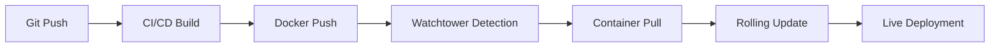

ROPAgen represents a modern, production-ready web application built with industry-leading technologies and best practices. The platform demonstrates excellence in software engineering through its sophisticated architecture, automated deployment pipeline, and cutting-edge user experience design.

## Technology Stack

### Core Framework & Runtime
ROPAgen is built on **[Next.js 15](https://nextjs.org/)**, leveraging the latest [React 19](https://react.dev/) features and server-side rendering capabilities. The application utilizes Next.js's App Router for optimal performance and developer experience, with [TypeScript](https://www.typescriptlang.org/) providing comprehensive type safety throughout the codebase.

### Frontend Technologies
The user interface showcases modern web development practices with a carefully curated technology stack:

- **[React 19](https://react.dev/)** with the latest hooks and concurrent features
- **[TypeScript 5](https://www.typescriptlang.org/)** for robust type checking and enhanced developer productivity
- **[Tailwind CSS 4](https://tailwindcss.com/)** for utility-first styling with custom design system integration
- **[Framer Motion 12](https://www.framer.com/motion/)** powering sophisticated animations and micro-interactions
- **[Radix UI](https://www.radix-ui.com/)** components ensuring accessibility compliance and consistent behavior
- **[next-themes](https://github.com/pacocoursey/next-themes)** for seamless dark/light mode transitions

### AI & Language Models
The document generation engine integrates multiple AI providers for maximum flexibility and reliability:

- **[OpenAI GPT-4](https://openai.com/gpt-4)** models via the official [AI SDK](https://sdk.vercel.ai/)
- **[Mistral AI](https://mistral.ai/)** integration for alternative language model options
- **[Vercel AI SDK](https://sdk.vercel.ai/)** providing unified interface for model switching
- Custom prompt engineering optimized for GDPR compliance document generation

### Internationalization & Accessibility
ROPAgen supports multiple languages through a sophisticated internationalization system:

- **[next-intl](https://next-intl-docs.vercel.app/)** for comprehensive i18n support (German and English)
- Dynamic locale routing with `/[locale]` structure
- Server-side translation loading for optimal performance
- Accessible UI components meeting [WCAG guidelines](https://www.w3.org/WAI/WCAG21/quickref/)

### Documentation System
The documentation platform utilizes **[Fumadocs](https://fumadocs.vercel.app/)**, a modern documentation framework built specifically for Next.js applications, providing:

- [MDX](https://mdxjs.com/)-based content with custom components
- Built-in search functionality
- Responsive design with mobile-first approach
- Syntax highlighting and code examples

### PDF Generation & Document Processing
Advanced document generation capabilities powered by:

- **[Puppeteer](https://pptr.dev/)** for high-fidelity PDF rendering
- **[Chromium](https://www.chromium.org/)** headless browser integration
- **[Marked](https://marked.js.org/)** for Markdown to HTML conversion
- Custom styling engine for professional document layouts

## Infrastructure & Deployment

### Version Control & Repository Management

ROPAgen is hosted on **[GitHub](https://github.com/ganglem/ropagen)**, following modern Git workflows and repository management practices. The project utilizes GitHub's comprehensive toolset for collaborative development:

- **Issue Tracking**: Feature requests and bug reports managed through GitHub Issues
- **Feature Branches**: Development follows a feature branch workflow into `dev` for testing
- **Branch Strategy**: `dev` → `main` promotion workflow for stable releases
- **Version Tags**: Semantic versioning with Git tags for release management
- **Milestones**: Project planning and release coordination through GitHub Milestones
- **Pull Requests**: Code review process ensuring quality and consistency

### Automated Git-to-Production Pipeline

The deployment architecture implements a fully automated CI/CD pipeline that transforms git commits into live deployments without manual intervention.

**Git Workflow**
The deployment process follows a branch-based strategy:

1. **Development Branch**: Commits to `dev` branch trigger automatic deployment to `dev.ropagen.eu`
2. **Main Branch**: Commits to `main` branch trigger automatic deployment to `ropagen.eu`
3. **Container Registry**: Each branch builds and pushes to [Docker Hub](https://hub.docker.com/) with appropriate tags

**Automated Build Process**
When code is pushed to either branch, the following automated sequence occurs:

```bash
# 1. GitHub Actions (or similar CI) detects push
git push origin main  # or dev

# 2. Automated Docker build process
docker build -t ganglem/ropagen:latest .        # for main branch
docker build -t ganglem/ropagen-dev:latest .    # for dev branch

# 3. Push to Docker Hub registry
docker push ganglem/ropagen:latest              # production image
docker push ganglem/ropagen-dev:latest          # development image

# 4. Watchtower detects new image and triggers deployment
```

**GitHub Actions Workflow**
The CI/CD pipeline is implemented using GitHub Actions with the following workflow configuration:

```yaml
name: Autodeploy MAIN

on:
  push:
    branches:
      - main

jobs:
  build:
    runs-on: ubuntu-latest

    steps:
      - name: Checkout repository
        uses: actions/checkout@v4

      - name: Set up Docker Buildx
        uses: docker/setup-buildx-action@v2

      - name: Log in to Docker Hub
        uses: docker/login-action@v2
        with:
          username: ${{ secrets.DOCKER_USERNAME }}
          password: ${{ secrets.DOCKER_TOKEN }}

      - name: Build and push Docker image
        uses: docker/build-push-action@v4
        with:
          context: .
          push: true
          tags: ganglem/ropagen:latest
```

This workflow automatically triggers on every push to the `main` branch, building a new Docker image and pushing it to Docker Hub with the `latest` tag. A similar workflow exists for the `dev` branch targeting the `ganglem/ropagen-dev:latest` image.

### Multi-Environment Docker Compose Configuration

The server runs both production and development environments simultaneously using [Docker Compose](https://docs.docker.com/compose/):

```yaml
services:
  # Production Environment
  app:
    container_name: ganglem-ropagen
    image: ganglem/ropagen:latest
    env_file: .env
    networks: [web]
    restart: unless-stopped
    labels:
      - traefik.enable=true
      - traefik.http.routers.ganglem-ropagen.rule=Host(`ropagen.eu`)
      - traefik.http.routers.ganglem-ropagen.entrypoints=websecure
      - traefik.http.routers.ganglem-ropagen.tls=true
      - traefik.http.routers.ganglem-ropagen.tls.certresolver=lets-encrypt
      - traefik.http.routers.ganglem-ropagen.middlewares=auth
      - com.centurylinklabs.watchtower.enable=true

  # Development Environment
  dev:
    container_name: ganglem-ropagen-dev
    image: ganglem/ropagen-dev:latest
    env_file: .env
    networks: [web]
    restart: unless-stopped
    labels:
      - traefik.enable=true
      - traefik.http.routers.ganglem-ropagen-dev.rule=Host(`dev.ropagen.eu`)
      - traefik.http.routers.ganglem-ropagen-dev.entrypoints=websecure
      - traefik.http.routers.ganglem-ropagen-dev.tls=true
      - traefik.http.routers.ganglem-ropagen-dev.tls.certresolver=lets-encrypt
      - traefik.http.routers.ganglem-ropagen-dev.middlewares=dev-auth
      - com.centurylinklabs.watchtower.enable=true

networks:
  web:
    external: true
```

### Deployment Features

**Automated Git-to-Production Pipeline**
- **Development**: `dev.ropagen.eu` (dev branch)
- **Production**: `ropagen.eu` (main branch)
- [Watchtower](https://containrrr.dev/watchtower/) monitors Docker Hub every 30 seconds for updates
- Zero-downtime deployments with graceful container restarts

**Security & SSL**
- [Let's Encrypt](https://letsencrypt.org/) automatic SSL certificate management
- Basic authentication protection for controlled access
- [Traefik](https://traefik.io/) reverse proxy with automatic service discovery
- Environment isolation through Docker networks

### Watchtower Auto-Deployment Mechanism

**Watchtower Configuration**
The server runs [Watchtower](https://containrrr.dev/watchtower/) as a separate container that monitors Docker Hub for image updates:

```yaml
# Watchtower service (typically in separate compose file)
watchtower:
  image: containrrr/watchtower
  container_name: watchtower
  volumes:
    - /var/run/docker.sock:/var/run/docker.sock
    - /root/.docker/config.json:/config.json
  command: --interval 30 --cleanup
  restart: unless-stopped
```

**Deployment Flow**
The complete deployment sequence works as follows:



1. **Push Detection**: Developer pushes to `main` or `dev` branch
2. **Automated Build**: CI system builds new Docker image with latest code
3. **Registry Update**: New image pushed to [Docker Hub](https://hub.docker.com/) with appropriate tag
4. **Watchtower Polling**: [Watchtower](https://containrrr.dev/watchtower/) checks for updates every 30 seconds
5. **Image Pull**: Downloads new image version automatically
6. **Rolling Update**: Stops old container, starts new one with zero downtime
7. **Health Check**: [Traefik](https://traefik.io/) verifies new container is responding correctly

### Multi-Environment Deployment

**Production Environment**
- **Domain**: `ropagen.eu`
- **Container**: `ganglem/ropagen:latest`
- **Branch**: `main`
- **Authentication**: Basic auth protection for controlled access
- **SSL**: Automatic Let's Encrypt certificate management
- **Update Trigger**: Push to main branch

**Development Environment**
- **Domain**: `dev.ropagen.eu`
- **Container**: `ganglem/ropagen-dev:latest`
- **Branch**: `dev`
- **Staging**: Full feature testing before production deployment
- **Update Trigger**: Push to dev branch

### Reverse Proxy & Load Balancing

**Traefik Configuration**
The infrastructure utilizes [Traefik](https://traefik.io/) with Docker provider for automatic service discovery:

```yaml
# Traefik labels decode to:
# - Automatic HTTPS with Let's Encrypt
# - Host-based routing (ropagen.eu vs dev.ropagen.eu)
# - Basic authentication middleware
# - Docker network integration
# - Health checking capabilities
```

**SSL Certificate Management**
```bash
# Automatic certificate provisioning
traefik.http.routers.ganglem-ropagen.tls.certresolver=lets-encrypt

# Automatic HTTP to HTTPS redirect
traefik.http.routers.ganglem-ropagen.entrypoints=websecure
```

### Automated Deployment Pipeline

**Zero-Downtime Deployment Process**

```bash
# 1. Developer workflow
git add .
git commit -m "feature: new functionality"
git push origin main  # triggers production deployment

# 2. Automated server-side process (no manual intervention)
# Watchtower detects new image
# Pulls ganglem/ropagen:latest
# Gracefully stops old container
# Starts new container with updated code
# Traefik automatically routes traffic to new container

# 3. Verification
curl https://ropagen.eu  # new version live
```

**Environment-Specific Configuration**
Each environment maintains separate configuration through [Docker](https://www.docker.com/) labels and environment files:

```bash
# Production deployment command (automated)
docker-compose up -d app

# Development deployment command (automated)
docker-compose up -d dev

# Both environments can run simultaneously on the same server
# Traefik routes traffic based on domain (ropagen.eu vs dev.ropagen.eu)
```

**Security & Access Control**
- Basic authentication with [bcrypt](https://en.wikipedia.org/wiki/Bcrypt)-hashed credentials
- Network isolation through Docker networks
- Environment variable management for sensitive data
- SSL/TLS encryption for all communications
- Automatic security updates through container rebuilds


This automated deployment architecture ensures that every code change reaches production through a reliable, tested pipeline while maintaining separate environments for development and production testing.


### Custom UI/UX Design System
ROPAgen features a bespoke design system emphasizing user experience:

**Interactive Components**
- Custom spotlight cards with dynamic mouse tracking
- Smooth animations and transitions using [Framer Motion](https://www.framer.com/motion/)
- Responsive design adapting to all screen sizes
- Dark/light theme support with system preference detection

**Visual Design**
- Custom typography with professional font selections
- Consistent color palette with semantic meaning
- Micro-interactions enhancing user engagement
- Accessibility-first approach ensuring inclusive design

## Data Architecture

### Model-Driven Development
The application follows a structured data model approach:

```typescript
interface DocumentData {
  // Comprehensive type definitions for GDPR document structure
  companyInfo: CompanyInfo;
  processingActivities: ProcessingActivity[];
  legalBasis: LegalBasis[];
  // Additional structured data types
}
```

### Template System
ROPAgen utilizes a flexible template architecture supporting:

- Multi-language template variations
- Dynamic content generation based on user input
- Extensible template structure for future requirements
- Version control for template updates

This technical architecture demonstrates ROPAgen's commitment to excellence in modern web development, showcasing industry best practices in containerization, deployment automation, and user experience design. The platform serves as an exemplar of how sophisticated software engineering principles can be applied to create production-ready applications that are both powerful and maintainable.
